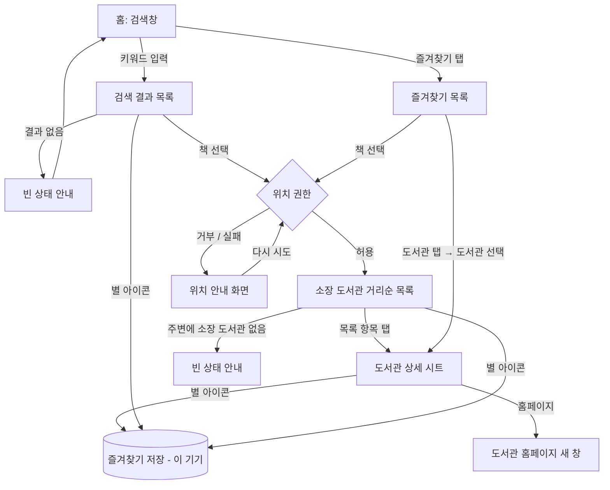

# billim-app 기획서

> 이 문서는 **무엇을, 왜** 만드는지 적는다. 개발 규칙은 `CLAUDE.md`에 있다.
> 기획이 바뀌면 코드보다 먼저 [결정 기록](#9-결정-기록)에 한 줄을 적는다.

## 1. 개요

| 항목 | 내용 |
|---|---|
| 이름 | billim-app |
| 한 줄 소개 | 읽고 싶은 책이 내 주변 공공도서관에 있는지, 대출할 수 있는지 가까운 순으로 한 번에 확인한다 |
| 대상 플랫폼 | 모바일 웹 우선 (휴대폰 브라우저, 세로 화면 기준) |
| 데이터 출처 | 도서관 정보나루 Open API (data4library.kr) |
| 배포 주소 | https://billim-app.vercel.app (Vercel Hobby, `main` push 시 자동 배포) |
| 꼭 지킬 제약 | 무료 서비스와 무료 플랜만 쓴다. 과금 API는 쓰지 않는다 |

## 2. 목표

- 도서관 홈페이지를 하나씩 열어 보지 않아도, **가까운 도서관 중 어디에 가면 빌릴 수 있는지** 바로 알 수 있다.
- 밖에서 휴대폰 한 손으로 쓸 수 있을 만큼 단순하다.

## 3. MVP: 이번 버전에서 꼭 되는 것

| # | 기능 | 설명 |
|---|---|---|
| F1 | 책 검색 | 제목, 저자, 출판사 중 범위를 골라 검색하고 결과 목록에서 책 1권을 고른다 |
| F2 | 현재 위치 | 브라우저 위치 권한으로 내 위치를 얻는다 |
| F3 | 소장 도서관 거리순 목록 | 고른 책을 가진 주변 도서관을 내 위치에서 가까운 순으로 보여 준다. 확인한 도서관 중 대출 가능한 곳을 먼저 보여 준다. 항목마다 거리, 대출 가능 여부(색과 글자)가 보인다 |
| F4 | 도서관 상세 | 목록 항목을 누르면 도서관 이름, 거리, 대출 가능 여부, 주소, 전화, 홈페이지 링크가 보인다 |
| F5 | 즐겨찾기 (책, 도서관) | 책과 도서관을 즐겨찾기에 넣고 뺀다. 즐겨찾기한 책은 바로 주변 도서관 확인으로 간다. 로그인 없이 이 기기에만 저장한다 |

## 4. 이번 버전에서 안 하는 것

새 기능이 이 목록과 부딪히면 먼저 짚고 결정 기록에 남긴다.

- 회원가입과 로그인, 여러 기기 간 즐겨찾기 동기화
- 대출 예약이나 상호대차 신청 (도서관 홈페이지 링크만 제공)
- 도서관 홈페이지 크롤링 (정보나루 API 데이터만 쓴다)
- 인기 도서, 추천 도서, 독서 기록
- 알림 (예: "대출 가능해지면 알려 줘")
- 길찾기 경로 안내
- 지도 표시 (하지 않는다. 거리순 목록만 보여 준다. 2026-11-03 결정)
- 네이티브 앱과 앱스토어 배포, PWA 설치
- 데스크톱 전용 레이아웃 (깨지지만 않으면 된다)

## 5. 사용자 흐름


```mermaid
flowchart TD
    A[홈: 검색창] -->|키워드 입력| B[검색 결과 목록]
    A -->|즐겨찾기 탭| F[즐겨찾기 목록]
    B -->|결과 없음| B0[빈 상태 안내] --> A
    B -->|책 선택| C{위치 권한}
    F -->|책 선택| C
    C -->|허용| D[소장 도서관 거리순 목록]
    C -->|거부 / 실패| C0[위치 안내 화면]
    C0 -->|다시 시도| C
    D -->|목록 항목 탭| E[도서관 상세 시트]
    F -->|도서관 탭 → 도서관 선택| E
    E -->|별 아이콘| S
    D -->|주변에 소장 도서관 없음| D0[빈 상태 안내]
    E -->|홈페이지| X[도서관 홈페이지 새 창]
    B -->|별 아이콘| S[(즐겨찾기 저장 - 이 기기)]
    D -->|별 아이콘| S
```

## 6. 화면별 명세

### S1. 홈 (검색)

```
┌─────────────────────────────┐
│ billim                [★ 2] │  ← 즐겨찾기 개수, 누르면 S5
│                             │
│  어떤 책을 빌리고 싶나요?   │
│ [제목] [저자] [출판사]      │  ← 검색 범위, 기본 제목
│ ┌─────────────────────┐ ┌─┐ │
│ │ 검색어              │ │🔍│ │
│ └─────────────────────┘ └─┘ │
│                             │
│  도서관 정보나루 데이터 기준│
└─────────────────────────────┘
```

- 보이는 것: 검색 범위(제목, 저자, 출판사), 검색창, 즐겨찾기 바로가기
- 할 수 있는 것: 범위를 골라 키워드 검색 (빈 키워드는 검색하지 않음), 즐겨찾기로 이동
- 주소: `/search?q={키워드}&by={title|author|publisher}`. `by`가 없거나 모르는 값이면 제목으로 본다
- 빈 상태: 해당 없음

### S2. 검색 결과

```
┌─────────────────────────────┐
│ ← [ 채식주의자          🔍] │
│ 제목으로 찾은 결과 12권     │
│ ┌────┐ 채식주의자        ☆  │
│ │표지│ 한강 · 창비 · 2007   │
│ └────┘                      │
│ ┌────┐ ...               ★  │
│ │표지│                      │
│ └────┘                      │
│        [ 더 보기 ]          │
└─────────────────────────────┘
```

- 보이는 것: 표지, 제목, 저자, 출판사, 출판 연도, 즐겨찾기 별
- 할 수 있는 것: 책 선택 → S3, 별 눌러 즐겨찾기 넣기/빼기, 더 보기, 키워드를 바꿔 다시 검색(지금 범위 그대로). 범위는 S1에서만 고른다
- 결과 개수 줄에 찾은 범위를 함께 보여 준다 ("제목으로 / 저자로 / 출판사로 찾은 결과 N권")
- 책을 골랐다가 뒤로 돌아오면 불러온 목록(더 보기 포함)과 스크롤 위치가 그대로다. 마지막 검색 하나를 이 탭의 sessionStorage에 30분 동안 둔다
- 빈 상태: "{범위} '{키워드}'에 맞는 책을 찾지 못했어요. 검색어나 범위를 바꿔 검색해 보세요." (예: "저자 '한강'에 맞는…")
- 오류: "책 정보를 불러오지 못했어요. 잠시 후 다시 시도해 주세요." + [다시 시도]

### S3. 위치 안내 (권한 거부 또는 위치 실패 시에만)

```
┌─────────────────────────────┐
│ ←                           │
│        📍                   │
│  내 위치를 알아야 가까운    │
│  도서관을 찾을 수 있어요.   │
│                             │
│  브라우저 설정에서 위치     │
│  권한을 허용한 뒤 다시      │
│  시도해 주세요.             │
│      [ 다시 시도 ]          │
│   [ 동네 골라서 찾기 ]      │
└─────────────────────────────┘
```

- 할 수 있는 것: 다시 시도, 뒤로 가기, 동네 골라서 찾기(S4로 간다)
- 위치 좌표는 저장하지 않는다
- 원인별 안내 문구 (첫 줄 "내 위치를 알아야 가까운 도서관을 찾을 수 있어요."는 같다)
  - 권한 거부: "브라우저 설정에서 위치 권한을 허용한 뒤 다시 시도해 주세요."
  - 위치를 못 찾음, 시간 초과: "위치를 찾지 못했어요. 잠시 후 다시 시도해 주세요."
  - 위치 기능 없음: "이 브라우저에서는 위치를 확인할 수 없어요." ([다시 시도] 대신 뒤로 가기)

### 동네 고르기 (S3, S4에서 연다)

- 시도를 고르고 시군구를 고른 뒤 [이 동네에서 찾기]를 누르면 그 동네의 대표 지점을 기준으로 S4를 보여 준다
- 동네 목록과 대표 지점은 `src/lib/areaDirectory.json`에 있다. `npm run update:libraries`가 전국 도서관 주소로 만든다(9장 2026-11-05)
- 고른 동네는 기억하지 않는다. 이 화면을 다시 열면 내 위치부터 시도한다

### S4. 소장 도서관 거리순 목록

```
┌─────────────────────────────┐
│ ← 채식주의자             ☆  │
│ 소장 293곳 · 확인한 5곳 중  │
│ 대출 가능 2곳               │
│ 확인 시각 15:42             │
│ 기준: 내 위치      [바꾸기] │  ← 동네를 고르면 "기준: 노원구"
│ ─────────────────────────── │
│ ○○시립도서관      0.8km     │
│     ● 대출 가능             │  ● 초록: 대출 가능
│ □□작은도서관      2.5km     │  ● 회색: 대출 중
│     ● 대출 가능             │  ● 노랑: 확인 실패
│ △△구립도서관      1.2km     │
│     ● 확인 실패             │
│ ...                         │
│        [ 더 보기 ]          │
└─────────────────────────────┘
```

- 보이는 것: 목록(이름, 거리, 상태), 요약 한 줄, 확인 시각(우리가 대출 여부를 조회한 시각). 상태는 색만으로 구분하지 않고 글자도 함께 쓴다
- 가까운 소장 도서관 5곳씩 보여 준다. [더 보기]를 누르면 다음 5곳의 대출 여부만 새로 확인한다
- 할 수 있는 것: 목록 항목 탭 → S4-1, 책 즐겨찾기 토글, 더 보기, 기준 바꾸기(동네 고르기, 동네 기준일 때는 내 위치로 돌아가기)
- 거리는 기준(내 위치 또는 고른 동네의 대표 지점)에서 잰 직선거리다
- 머리의 책 제목: 이미 즐겨찾기한 책이면 저장된 정보로 바로 보여 준다. 아니면 ISBN으로 책을 조회한다. 조회 중에는 제목 자리에 회색 틀을 두고, 실패하면 "주변 도서관"을 보여 준다. 둘 다 별은 숨긴다. 목록은 책 조회와 따로 동작한다
- 불러오는 중(위치 확인, 소장 도서관 확인)에는 목록 모양의 회색 틀을 보여 준다. S2 검색 결과도 같다
- 뒤로(←): 앱 안에서 이 화면으로 왔으면 이전 화면(S2 검색 결과, S5 즐겨찾기)으로 돌아간다. 주소를 직접 열어 이전 화면이 없으면 홈(S1)으로 간다. S3의 [뒤로 가기]도 같다
- 정렬: 지금까지 확인한 도서관을 대출 가능 → 대출 중 → 확인 실패로 묶고, 묶음 안에서는 직선거리가 가까운 순. [더 보기]로 새로 확인한 대출 가능 도서관은 기존 대출 중 항목보다 위로 들어간다
- 빈 상태: "주변 도서관에는 이 책이 없어요." 
- 오류: "도서관 정보를 불러오지 못했어요." + [다시 시도]

### S4-1. 도서관 상세 (아래에서 올라오는 시트)

```
├─────────────────────────────┤
│ ○○시립도서관     0.8km   ☆  │  ← 도서관 즐겨찾기
│ ● 대출 가능                 │
│ 주소: ...                   │
│ 전화: 02-000-0000  [전화]   │
│ 운영 시간: 평일 09:00~18:00 │
│ 휴관일: 매주 월요일 / ...   │
│ [ 도서관 홈페이지 열기 ↗ ]  │
└─────────────────────────────┘
```

### S5. 즐겨찾기

```
┌─────────────────────────────┐
│ ← 즐겨찾기                  │
│ [ 책 (2) ] [ 도서관 (1) ]   │  ← 탭
│ ┌────┐ 채식주의자        ★  │
│ │표지│ 한강                 │
│ └────┘   [ 주변에서 찾기 ]  │
└─────────────────────────────┘
도서관 탭:
│ ○○시립도서관             ★  │
│ 주소 · 전화                 │
```

- 할 수 있는 것: 책 → 주변에서 찾기(S4), 도서관 → 상세 시트(S4-1), 별 눌러 빼기
- 빈 상태 (책): "아직 즐겨찾기한 책이 없어요. 검색 결과에서 ☆를 눌러 저장해 보세요."
- 빈 상태 (도서관): "아직 즐겨찾기한 도서관이 없어요. 도서관 상세에서 ☆를 눌러 저장해 보세요."
- 도서관 탭에서는 특정 책의 대출 가능 여부를 보여 주지 않는다 (책을 고른 뒤 S4에서 확인)
- 안내: "즐겨찾기는 이 기기의 이 브라우저에만 저장돼요."
- 저장 실패 (저장소가 막혀 있거나 꽉 참): "이 브라우저에서는 즐겨찾기를 저장할 수 없어요." 별 상태는 바꾸지 않는다. S2와 S4-1의 별에도 같은 문구를 쓴다

## 7. "다 됐다"의 기준

공통: `npx tsc --noEmit`, `npm run lint`, `npm test`, `npm run build`가 모두 통과한다.

| 기능 | 완료 기준 | 직접 확인할 것 |
|---|---|---|
| F1 책 검색 | 실제 정보나루 키로 제목, 저자, 출판사 범위별 검색 결과가 나온다. 결과 화면에서 범위를 누르면 바로 다시 검색된다. 결과 없음과 오류 상태가 보인다. 응답 변환과 범위 선택 로직에 테스트가 있다 | 실제 휴대폰에서 한글 키워드를 범위별로 검색 |
| F2 현재 위치 | 허용하면 S4 목록으로, 거부하면 S3로 간다. 다시 시도가 동작한다 | 실제 휴대폰(https 배포 주소)에서 허용과 거부를 각각 확인 |
| F3 거리순 목록 | 확인한 도서관이 대출 가능 → 대출 중 → 확인 실패로 묶이고, 묶음 안에서는 가까운 순이다. 항목마다 거리와 상태(색과 글자)가 보인다. 거리 계산과 정렬 로직에 테스트가 있다 | 실제 위치에서 같은 묶음 안의 순서가 실제 거리 순서와 맞는지, 아는 도서관 1곳의 상태가 도서관 홈페이지와 같은지 비교 |
| F4 도서관 상세 | 목록 항목을 누르면 시트가 열린다. 전화와 홈페이지 링크가 동작한다 | 휴대폰에서 전화 앱이 열리는지 확인 |
| F5 즐겨찾기 | 책과 도서관 모두 넣기/빼기가 새로고침 후에도 유지된다. 저장 로직에 테스트가 있다 | 휴대폰 브라우저를 닫았다 열어도 두 탭이 유지되는지 확인 |

## 8. 외부 API 확인 목록

추측하지 않고 실제 응답으로 확인한 뒤 이 표를 채운다.

| 항목 | 상태 | 확인 결과 |
|---|---|---|
| 정보나루 인증키 발급 | 활성화됨 (2026-10-29) | 2026-10-27에는 `{"response":{"errCode":"vitalizationErr","error":"API 활성화 상태가아닙니다."}}`. **오류도 HTTP 200으로 온다** → 상태 코드가 아니라 `response.error`로 실패를 판단해야 한다. 2026-10-29 정상 응답 확인 |
| 일일 호출 한도 | 하루 499건 | 사용자가 정보나루 마이페이지에서 확인 (2026-10-29). 응답에는 한도 정보가 없다. 한도를 넘었을 때의 응답은 미확인 |
| `libSrch` 응답 | 확인 | `libSrchByBook`과 같은 `libs[].lib` 형태에 `BookCount`가 더 있다. `pageSize=500`이면 한 번에 다 온다(경기 400곳). 2026-10-29 기준 17개 시도 합계 약 1,620곳, 받아 본 곳 중 좌표 없는 곳은 없었다. 런타임에는 부르지 않고 갱신 스크립트에서만 쓴다(9장 2026-11-03) |
| `bookExist` 오류 | 확인 | 없는 도서관 코드면 `{"errCode":"libCodeErr","error":"도서관 코드를 확인하시기 바랍니다."}` |
| `bookExist`가 대출 가능 여부도 주는지, 실시간인지 전날 기준인지 | 대출 가능 여부: 있음 / 기준 시각: 미확인 | `{"response":{"request":{...},"result":{"hasBook":"Y","loanAvailable":"Y"}}}`. 값은 `"Y"`/`"N"` 문자열. 응답에 기준 시각이 없다 → F3 직접 확인(도서관 홈페이지와 비교)으로 판단한다 |
| `libSrchByBook` 응답에 도서관 좌표(위도/경도)가 있는지 | 있음 | `response.libs[].lib` 안에 `libCode`, `libName`, `address`, `tel`, `fax`, `latitude`, `longitude`, `homepage`, `closed`, `operatingTime`. 좌표는 **문자열**(`"37.492994"`). `numFound`(전체 수), `resultNum`(이번 쪽 수). 소장 도서관이 없으면 `numFound: 0, libs: []`. `region`이 **필수**: 빼면 `{"errCode":"regionCodeErr","error":"지역코드를 확인해 주시기 바랍니다."}` |
| `libSrchByBook`의 `operatingTime`, `closed` 값 모양 | 확인 | 둘 다 **자유 문장 문자열**이다. 2026-11-05 서울 293곳: `operatingTime`은 150가지, 66곳이 `"-"`(정보 없음), 가장 긴 값 265자(`"자료실: 평일 09:00-18:00, 주말 09:00-17:00 / 열람실: 07:00-22:00"` 같은 꼴). `closed`는 107가지, 1곳이 `"-"`, 가장 긴 값 114자(`"매주 월요일 / 법정공휴일"` 같은 꼴). 줄바꿈과 빈 문자열은 없었다. 형식이 제각각이라 "지금 열림"을 계산하지 않고 원문을 보여 준다 |
| `libSrch`의 `address` 모양 (동네 묶기) | 확인 | 2026-11-05 전국 17개 시도 1,634곳. 첫 단어는 정식 시도 이름이고 줄임말("서울시")은 없다. 예외: "전남광주통합특별시"로 시작하는 주소 7곳(코드 24에 북구 5곳, 36에 광양시·영암군 2곳), 코드 33(충북)인데 주소가 "강원특별자치도 원주시"인 곳 1곳, 주소가 없거나 `"-"`인 곳 2곳(경기). 둘째 단어가 시군구이고, 세종(17곳)은 시군구 없이 도로명이 온다. 시 아래 구는 셋째 단어("경기도 수원시 장안구 …", "경상북도 포항시 북구 …"). 구가 섞인 시: 부천시 36곳 중 34곳, 화성시 32곳 중 26곳, 수원시 26곳 중 1곳이 구 없이 온다. 좌표 없는 곳은 없었다. 동네 268개 |
| `region` 코드 체계 (위치 → 지역 코드 변환 방법) | 확인 | **정보나루 자체 코드**이고 법정동 코드와 다르다. 시도: 서울 11, 부산 21, 대구 22, 인천 23, 광주 24, 대전 25, 울산 26, 세종 29, 경기 31, 강원 32, 충북 33, 충남 34, 전북 35, 전남 36, 경북 37, 경남 38, 제주 39 (41, 50은 `regionCodeErr`). 시군구 `dtl_region`도 자체 코드(노원구 11110, 광진구 11050. 법정동 노원구 11350은 0건). `libSrchByBook`과 `pageSize=500`이면 서울 소장 293곳이 한 번에 온다. 변환 방법은 9장 결정 기록 |
| `srchBooks` 응답 필드 (표지, ISBN13 포함 여부) | 있음 | `response.numFound`(전체 수), `response.docs[].doc` 안에 `bookname`, `authors`, `publisher`, `publication_year`, `isbn13`, `bookImageURL`, `bookDtlUrl`, `loan_count`(문자열) 등. 기본 정렬은 대출 많은 순. 결과 없으면 `numFound: 0, docs: []`. 표지 주소가 **`http://`인 경우가 있다**(https 페이지에서 섞인 콘텐츠). `bookname`에 부제가 `:`로 붙고 끝에 공백이 있을 수 있다(`"작별하지 않는다 :한강 장편소설 "`), `authors`에 `지은이: ` 같은 접두가 붙을 수 있다 |
| `srchBooks` 검색 파라미터 (`keyword`, `title`, `author`, `publisher`) | 확인 (2026-11-04) | **`keyword`는 제목·저자 검색이 아니다.** 책 내용에서 뽑은 키워드(`keywordList`)와 소개글까지 찾고 대출 많은 순이라 관계없는 인기 책이 앞에 온다(`keyword=고래` 1위 『놓지 마 과학! 7』은 제목·저자·소개글에 '고래'가 없고 `keywordList`에 '고래' 가중치 6, 17위 『고령화 가족』은 소개글에 "〈고래〉의 작가"). `exactMatch=true`도 결과가 같다. `title`, `author`, `publisher`는 각각 그 필드만 부분 일치로 찾고 응답 형태는 같다(`title=고래` 상위 10권 모두 제목에 '고래', `author=한강` 107권, `publisher=창비` 5,087권). 함께 보내면 AND(`author=한강&publisher=창비` 11권). `title`은 부제까지 보므로 `title=한강`도 `:한강 장편소설` 부제 때문에 431권. 값이 공백뿐이면 **빈 본문**이 온다(JSON 아님) |
| `srchBooks`로 ISBN 한 권 조회 | 확인 (2026-11-04) | `isbn13=9788936433598` → `numFound: 1`, 검색과 같은 `docs[].doc` 형태(『채식주의자』). 없는 ISBN(`9780000000000`)은 `numFound: 0, docs: []` |
| ~~(다음 버전) 카카오맵 JavaScript SDK 무료 한도와 키 발급, 도메인 등록 조건~~ | 안 함 | 지도를 넣지 않기로 했다 (9장 2026-11-03) |

## 9. 결정 기록

| 날짜 | 결정 | 이유 |
|---|---|---|
| 2026-10-27 | 앱 이름은 billim-app | 사용자 결정 |
| 2026-10-27 | 모바일 웹 우선 | 밖에서 휴대폰으로 확인하는 사용 상황이 많다 |
| 2026-10-27 | 데이터는 도서관 정보나루 API만 쓴다 | 무료이고 공공도서관 소장 데이터를 제공한다 |
| 2026-10-27 | 정보나루 API는 서버(Route Handler)를 거쳐 호출한다 | 인증키를 숨겨야 하고, API가 http라서 https 페이지에서 직접 부르면 막힌다 |
| 2026-10-27 | 주변 기준은 현재 위치, 거리순 정렬 | 사용자 결정 |
| 2026-10-27 | ~~MVP는 지도 화면만, 목록 화면은 안 한다~~ → 지도와 거리순 목록을 한 화면에 함께 둔다 | 사용자 정정. 거리순 목록이 필요하다 |
| 2026-10-27 | 즐겨찾기는 로그인 없이 기기(localStorage)에 저장 | 로그인을 안 하는 것에 넣었다. 무료 제약 |
| 2026-10-27 | 즐겨찾기 대상은 책과 도서관 둘 다 | 사용자 결정 |
| 2026-10-27 | 지도는 카카오맵 JavaScript SDK | 사용자 결정. 국내 지도와 지명이 정확하고 무료다 |
| 2026-10-27 | MVP는 거리순 목록 화면만 만들고, 지도(카카오맵)는 다음 버전으로 미룬다 | 사용자 결정. 목록부터 만든다 |
| 2026-10-27 | 거리 비교는 화면 단위(0.1km)로 반올림한 값으로 한다. 같으면 대출 가능 → 대출 중 → 확인 실패 순 | 사용자 결정. 소수점까지 같을 때만 동점으로 보면 상태 우선 규칙이 사실상 쓰이지 않는다 |
| 2026-10-27 | 좌표가 없는 도서관은 목록 맨 뒤에 두고 거리는 "알 수 없음"으로 보여 준다 | 사용자 결정. 소장 정보는 버리지 않는다 |
| 2026-10-27 | S3 안내 문구를 원인(권한 거부 / 위치 못 찾음·시간 초과 / 위치 기능 없음)별로 나눈다 | 사용자 결정. 권한 문제가 아닌데 권한 허용을 안내하면 사용자가 헤맨다 |
| 2026-10-27 | 즐겨찾기 저장에 실패하면 화면에 알리고, 앱은 멈추지 않는다 | 사용자 결정. 사파리 프라이빗 모드 등에서 localStorage가 막힐 수 있다 |
| 2026-10-27 | 배포는 Vercel Hobby (https://billim-app.vercel.app) | 사용자 결정. 무료이고 https라서 휴대폰 위치 권한 테스트가 된다 |
| 2026-10-27 | CI는 GitHub Actions 무료 한도(월 2,000분)까지만 쓴다. 결제 수단을 등록하지 않는다 | 사용자 결정. 결제 수단이 없으면 한도를 넘었을 때 실행만 막히고 과금되지 않는다 |
| 2026-10-27 | 무료 서비스와 무료 플랜만 사용 | 사용자 제약 |
| 2026-10-27 | Next.js 16 (App Router, `src/`) + TypeScript + Tailwind CSS 4, 테스트는 Vitest 5 | create-next-app 기본 구성. Route Handler로 정보나루 키를 숨길 수 있다 |
| 2026-10-27 | Node 24 LTS (`.nvmrc`, `engines`) | 사용자 결정. Vitest 5가 Node 22.12 이상을 요구한다 |
| 2026-10-29 | 검색 결과의 제목과 저자는 부제, "지은이:" 같은 앞말까지 원본 그대로 보여 준다 | 사용자 결정. 콜론이 원래 제목에 있는 책도 있다 |
| 2026-10-29 | 위치 → 지역 코드(Q4)는 추가 API 없이 정한다. `libSrch`로 전국 도서관 좌표를 받아 하루 캐시하고, 내 위치 20km 안에 도서관이 있는 시도를 모두 쓴다(없으면 가장 가까운 도서관의 시도) | 정보나루 지역 코드가 자체 코드라서 좌표→주소 API를 붙여도 변환표가 따로 필요하다. 시도 경계 근처도 이웃 시도까지 찾는다 |
| 2026-10-29 | S4는 가까운 소장 도서관 5곳씩 보여 주고 [더 보기]로 다음 5곳을 확인한다. 더 보기 1번 = `bookExist` 5번 | 사용자 결정. 하루 호출 한도 499건 |
| 2026-10-29 | S4 요약은 "소장 N곳 · 확인한 M곳 중 대출 가능 K곳", 기준 시각 대신 우리가 조회한 "확인 시각"을 보여 준다 | 사용자 결정. `bookExist` 응답에 기준 시각이 없다. 확인 시각은 화면을 보고 다시 정한다 |
| 2026-10-29 | 좌표는 POST 본문으로 서버에 보낸다 | 주소(쿼리)에 넣으면 서버 접근 로그에 남을 수 있다 |
| 2026-10-29 | `libSrch`, `libSrchByBook`은 `'use cache: remote'`로 하루 캐시하고, 실패는 캐시하지 않는다. `bookExist`는 캐시하지 않는다 | 기본 `'use cache'`는 서버리스 인스턴스마다 따로라서 호출이 늘 수 있다. Vercel Hobby라 과금되지 않는다 |
| 2026-11-03 | 전국 도서관 좌표(`libSrch`)는 런타임에 부르지 않고 `src/server/data4library/libraryDirectory.json`에 두고 `npm run update:libraries`로 갱신한다(한 번에 17건, 한 달에 한 번쯤). 10-29의 "`libSrch` 하루 캐시"를 대체한다. `libSrchByBook` 캐시는 그대로 | 사용자 결정. 캐시가 빈 첫 검색에 `libSrch` 17건이 더해져 약 25건이 들었다. 좌표 파일로 바꾸면 검색당 6~8건이고, 시도 경계 근처 이웃 시도 찾기도 그대로 된다 |
| 2026-11-03 | S4는 확인한 도서관을 대출 가능 → 대출 중 → 확인 실패로 묶어 보여 주고, 묶음 안에서는 가까운 순. 순번 표시는 뺀다. 10-27 "거리 먼저, 같으면 상태" 정렬을 화면에서는 대체한다 | 사용자 결정. 빌릴 수 있는 곳을 먼저 보고 싶다. 대출 여부는 확인한 곳(5곳씩)만 알 수 있어서 확인한 범위 안에서만 다시 세운다. 순번은 섞여 보여서 뺐다 |
| 2026-11-03 | 지도(카카오맵)는 다음 버전에도 넣지 않는다. 10-27 "지도는 다음 버전" 결정을 대체한다 | 사용자 결정. 거리순 목록으로 충분하다 |
| 2026-11-04 | 책 검색은 범위 [제목 \| 저자 \| 출판사] 중 하나를 골라 `srchBooks`의 `title`/`author`/`publisher`로 찾는다. 기본은 제목이고 `keyword`는 쓰지 않는다 | 사용자 결정. `keyword`는 책 내용 키워드까지 찾아서 '고래' 검색에 관계없는 책이 앞에 왔다(8장). 제목+저자를 합치는 안은 검색당 호출이 2건이고 쪽 나누기가 맞지 않아 뺐다 |
| 2026-11-04 | S4 머리의 책 정보(제목, 즐겨찾기용 저자·표지)는 서버에서 `srchBooks?isbn13=`로 조회하고 `'use cache: remote'`로 하루 캐시한다. 없는 ISBN도 캐시하고, 실패는 캐시하지 않는다 | 사용자 결정. 주소로 넘기는 안은 호출이 없지만 새로고침이나 직접 연 주소에서 제목이 사라진다. 캐시가 없는 책만 S4당 1건이 는다 |
| 2026-11-04 | 화면 테마는 "말랑 니트": 오트밀 베이지 바탕에 옅은 니트 짜임 무늬, 글자가 있는 면(카드, 시트)은 단색 쿠션. 누르는 것(버튼, 검색 범위, 즐겨찾기 개수)은 펠트 질감과 바느질 땀, 아래 두께가 있고 누르면 눌렸다가 튀어 오른다. 색 역할은 꿀색 = 주 버튼, 민트 = 고른 범위, 복숭아 = 즐겨찾기 개수, 크림 = 나머지 버튼. 대출 여부는 칠한 배지(초록·회색·주황). 글꼴은 본문 고운돋움, 제목과 버튼 주아(Google Fonts, `next/font`). 다크 모드는 코코아 톤. 누르는 영역은 44px 이상 | 사용자 결정. 베이지 톤의 폭닥하고 귀여운 느낌. 시안 4개를 화면으로 비교해 골랐다. 질감은 바깥 바탕과 버튼에만 두어 밖에서도 글자가 잘 읽히게 한다 |
| 2026-11-04 | S2(검색 결과)에서 범위 버튼을 뺀다. 범위는 S1에서만 고르고, S2에서 다시 검색하면 지금 범위를 그대로 쓴다. 찾은 범위는 결과 개수 줄에 보여 준다. 같은 날 "S2에서 범위를 누르면 바로 다시 검색" 결정을 대체한다 | 사용자 결정. 결과 화면을 단순하게 |
| 2026-11-04 | S2 결과(불러온 책, 쪽 수, 스크롤 위치)를 마지막 검색 하나만 sessionStorage에 30분 둔다. 같은 범위·검색어로 돌아오면 정보나루를 다시 부르지 않고 복원한다 | 사용자 결정. 책을 골랐다 돌아오면 더 보기로 불러온 목록이 사라지고 스크롤이 어긋났다. 탭을 닫으면 사라지고 위치 좌표는 담지 않는다 |
| 2026-11-05 | 파비콘은 글자 아이콘 "B": 꿀색 둥근 네모에 바느질 땀, 진한 갈색 B. `src/app/icon.svg` 하나로 두고 기본 `favicon.ico`(Next 로고)는 지운다 | 사용자 결정. 이미지를 따로 받지 않고 테마 색으로 만든다 |
| 2026-11-05 | S5 즐겨찾기 탭의 좌우 화살표 이동은 하지 않는다 | 사용자 결정. 탭 두 개가 모두 Tab 키로 닿아서 키보드로 쓸 수 있다 |
| 2026-11-05 | S4-1 도서관 상세에 운영 시간과 휴관일(`operatingTime`, `closed`)을 받은 글 그대로 보여 준다. 즐겨찾기 도서관에도 함께 저장하고, 두 값이 없는 예전 즐겨찾기는 "정보 없음"으로 보여 준다 | 사용자 결정. 대출 가능한 곳에 갔는데 닫혀 있으면 헛걸음이다. 이미 받는 응답이라 호출이 늘지 않는다. 형식이 제각각이라 "지금 열림"은 계산하지 않는다(8장) |
| 2026-11-05 | 위치 대신 동네(시도 → 시군구)를 골라 찾을 수 있다. S3과 S4에서 연다. 기준점은 그 동네 도서관 좌표의 중앙값(위도·경도 각각)이고, 고른 동네는 기억하지 않는다 | 사용자 결정. 위치 권한을 거부하거나 위치를 못 찾으면 막혔다. 다른 동네(회사 근처 등)도 볼 수 있다. 정보나루에 시군구 목록 API가 없어서 `libSrch` 주소로 만든다. 공개된 도서관 위치로 정해서 사용자 위치를 저장하지 않는다. 평균 대신 중앙값인 것은 좌표가 틀린 도서관 때문이다: 광주 북구 하서로 299가 서울 성북구 좌표라 평균이 38.5km, 여수시 웅천6길 51이 전주 좌표라 15.6km 밀렸다(김포·하남에도 있다) |
| 2026-11-05 | 동네 묶기 규칙: 시도는 주소 첫 단어가 정식 시도 이름이면 그것, 아니면 정보나루 지역 코드의 시도. 시군구는 둘째 단어. 시 안에서 절반 넘는 도서관 주소에 구가 있으면 구 단위("수원시 장안구")로 나누고 구가 없는 주소는 대표 지점 계산에서만 뺀다. 아니면 시 하나로 묶는다. 시군구가 없는 주소(세종)는 시도 하나를 동네로 본다. 주소가 없으면 뺀다 | 사용자 결정. 통합특별시 주소는 지역 코드 쪽 시도로, 코드와 주소가 다른 원주는 실제 위치인 주소 쪽으로 간다. 구가 막 생겨 주소가 섞인 부천시·화성시가 "부천시"와 "부천시 원미구"로 갈라지지 않게 한다 |

## 10. 미결 사항

- ~~Q3. 지도를 움직이면 그 지역으로 다시 검색할지~~: 지도를 넣지 않기로 해서 닫음 (9장)
- ~~Q4. 위치 → 지역 코드 변환 방법~~: `libSrch` 좌표로 정하기로 결정, 좌표는 정적 파일로 둔다 (9장)
- ~~Q5. 배포처~~: Vercel Hobby로 결정 (9장)
